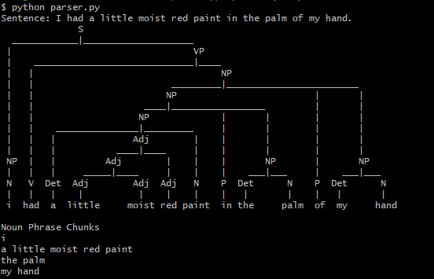

# NLparser
Natural language parser to determine the structure of a sentence

## Description

Knowing the structure of a sentence can help a computer to better understand the meaning of the sentence, and it can also help the computer extract information out of a sentence. In this exercise, the aim is to create a simple parser that can determine the structure of all the sentences in the sentences folder. In order to use this parser with other than these sentences you will need to add the new vocabulary to the TERMINAL symbols.

## Example

To run the application you first need to install nltk by executing :

``
pip install -r requirements.txt
``

Then you can run the parser.py file. In this example we use sentence 10 : 

